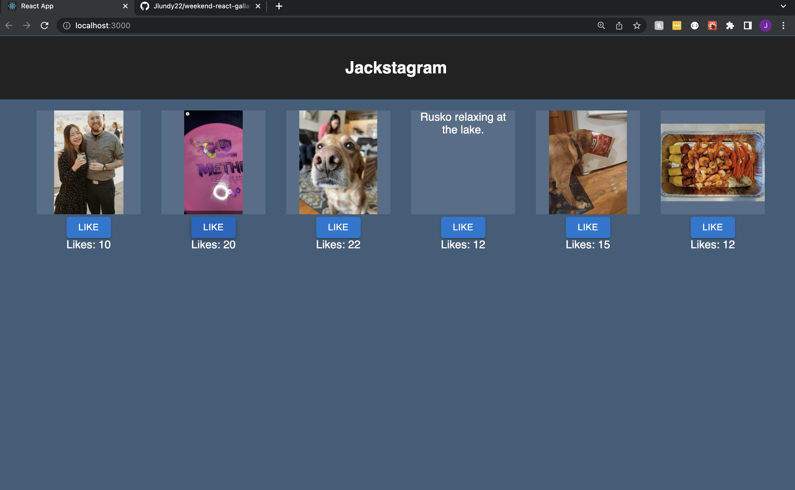

#  React Gallery

## Description

_Duration: 10 hours_

This is the first app I built using react. We were not asked to utilize a database for this this project. All of the info comes from gallery.data.js and requests to the server. 

### Prerequisites

- [Node.js](https://nodejs.org/en/)

## Installation

1. Open up your editor of choice and run an `npm install`
2. Run `npm run server` in your terminal
3. Run `npm run client` in your terminal
4. The `npm run client` command will open up a new browser tab for you!

## Acknowledgement
Thanks to [Prime Digital Academy](www.primeacademy.io) who equipped and helped me to make this application a reality. (Thank your people)
